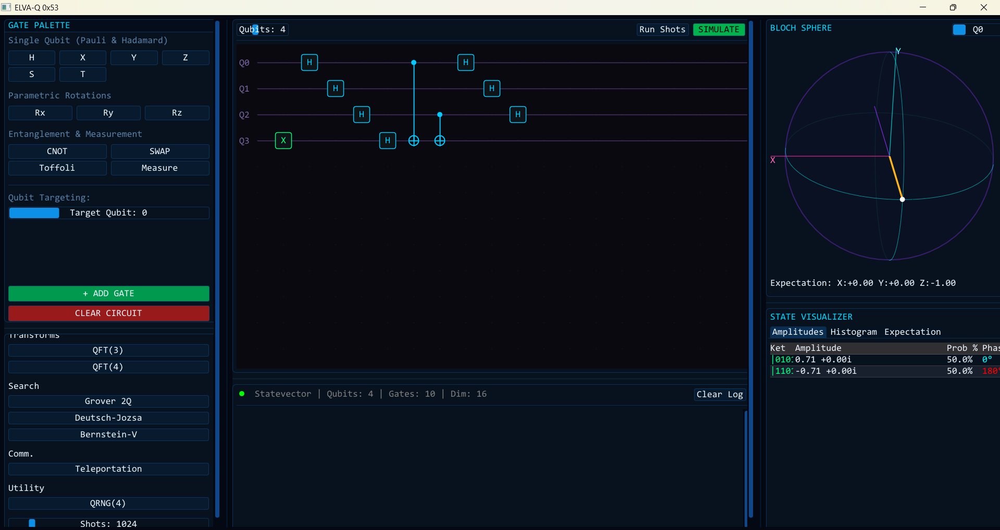
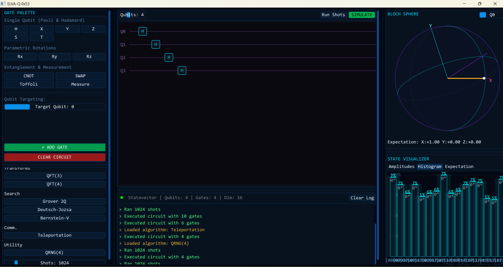

<div align="center">

<h1><B>ELVA-Q 0x53</B></h1>

### **Quantum Circuit Simulator**
*Built from mathematical first principles — no quantum SDK required*

<br/>


<br/>

> **ELVA-Q 0x53** is a real-time, interactive quantum circuit simulator written in C++17.
> Every gate, measurement, and algorithm is derived from the postulates of quantum mechanics
> and implemented from scratch — no Qiskit, no Cirq, no external quantum library.

<br/>

</div>

---

## 🖥️ Screenshots

<div align="center">

**QFT(4) Circuit — 4 Qubits · 10 Gates · Bloch Sphere · State Visualizer**



<br/>

**QRNG(4) — Quantum Random Number Generator · 1024 Shots Histogram**



</div>

> *Left panel: Gate Palette · Centre: Circuit Editor · Right: Bloch Sphere + State Visualizer*

---

## ✨ Features

| Category | Details |
|---|---|
| 🔢 **State Vector Engine** | Exact dense simulation up to 20 qubits (2²⁰ amplitudes) |
| 🔷 **Gate Library** | 20+ gates: Pauli, Clifford, Rotation (Rx/Ry/Rz), U3, CNOT, CZ, SWAP, Toffoli, iSWAP |
| 📐 **Measurement** | Born-rule projective measurement with full wavefunction collapse |
| 🌐 **Bloch Sphere** | Real-time 3D Bloch vector from Pauli expectation values ⟨X⟩ ⟨Y⟩ ⟨Z⟩ |
| 📊 **Shot Simulation** | Multi-shot histogram engine (10 – 10,000 shots) |
| 🧠 **Built-in Algorithms** | Bell states, GHZ, QFT, Grover, Teleportation, BV, QAOA, and more |
| ⚡ **Real-time GUI** | Immediate-mode UI via Dear ImGui — 60 fps, no layout files |

---

## 🚀 Quick Start

### Prerequisites

- CMake ≥ 3.14
- C++17 compiler (GCC 9+, Clang 10+, MSVC 2019+)
- OpenGL 3.0 capable GPU
- Git (for FetchContent to pull dependencies)

> **All other dependencies (GLFW, Dear ImGui, ImPlot) are fetched and built automatically by CMake.**

### Build

```bash
# 1. Clone the repository
git clone https://github.com/itss-meS/ELVA-Q-0x53-Quantum-Circuit-Simulator-.git
cd ELVA-Q-0x53-Quantum-Circuit-Simulator

# 2. Configure
cmake -B build -DCMAKE_BUILD_TYPE=Release

# 3. Build
cmake --build build --config Release

# 4. Run
./build/quantum_sim_gui            # Linux / macOS
build\Release\quantum_sim_gui.exe  # Windows
```

---

## 🧮 Mathematical Foundation

ELVA-Q implements the complete quantum mechanics formalism from scratch:

**State Vector** — an n-qubit pure state is a unit vector in ℂ²ⁿ:

```
|Ψ⟩ = Σ αₓ |x⟩    where  Σ |αₓ|² = 1
```

**Gate Application** — single-qubit unitary U on qubit q (O(2ⁿ), no full matrix needed):

```
[α'ᵢ]   [u₀₀  u₀₁] [αᵢ]
[α'ⱼ] = [u₁₀  u₁₁] [αⱼ]    for all i where bit q = 0,  j = i | (1 << q)
```

**Born Rule** — measurement probability and collapse:

```
P(x) = |αₓ|²       post-measurement: |Ψ⟩ → |x⟩
```

**Bloch Vector** — single-qubit state visualized in ℝ³:

```
⟨X⟩ = 2 Re(α*β)     ⟨Y⟩ = 2 Im(α*β)     ⟨Z⟩ = |α|² − |β|²
```

---

## 🧠 Built-in Algorithms

| Algorithm | Qubits | What it demonstrates |
|---|---|---|
| Bell \|Φ+⟩ \|Φ−⟩ \|Ψ+⟩ \|Ψ−⟩ | 2 | Maximal entanglement, CHSH violation |
| GHZ(3), GHZ(4) | 3–4 | Multipartite entanglement |
| QFT(3), QFT(4) | 3–4 | Quantum Fourier Transform — O(n²) gates |
| Grover 2Q | 2 | Quadratic search speedup, amplitude amplification |
| Deutsch–Jozsa | 3 | Constant oracle, quantum parallelism |
| Bernstein–Vazirani | 4 | Hidden bitstring recovery in 1 query |
| Quantum Teleportation | 3 | State transfer via Bell pair + 2 classical bits |
| Superdense Coding | 2 | 2 classical bits per 1 qubit transmission |
| QAOA Ring | n | Quantum Approximate Optimization |
| QRNG(4) | 4 | True quantum random number generation |
| Phase Estimation Demo | 4 | QPE with controlled-U |

---

## 🗂️ Project Structure

```
ELVA-Q-0x53/
├── CMakeLists.txt          ← Build system (auto-fetches all deps)
├── screenshots/            ← UI screenshots for README
├── include/
│   ├── complex.hpp         ← Custom ℂ arithmetic (z = a + bi)
│   ├── statevector.hpp     ← n-qubit state vector, measurement, expectations
│   ├── gates.hpp           ← Matrix2 + all gate factories + GateApply
│   ├── circuit.hpp         ← Circuit builder API + run() executor
│   ├── algorithms.hpp      ← Preset circuit factories (Bell, GHZ, QFT, …)
│   └── app_state.hpp       ← Global simulation state + shot engine
└── src/
    ├── main.cpp            ← GLFW/ImGui init + render loop
    ├── app.cpp             ← SetupStyle() + RenderFrame()
    └── panels/
        ├── gate_palette.cpp   ← Gate selection UI
        ├── circuit_panel.cpp  ← Circuit view + run controls
        ├── state_panel.cpp    ← Amplitude table + probability chart
        ├── bloch_panel.cpp    ← 3D Bloch sphere (ImPlot)
        ├── algo_panel.cpp     ← Algorithm loader panel
        └── log_panel.cpp      ← Scrolling status log
```

---

## 🔧 Dependencies

All fetched automatically via CMake `FetchContent` — **no manual installation needed.**

| Library | Version | Purpose |
|---|---|---|
| [GLFW](https://github.com/glfw/glfw) | 3.4 | Window + OpenGL context |
| [Dear ImGui](https://github.com/ocornut/imgui) | v1.91.6 | Immediate-mode GUI |
| [ImPlot](https://github.com/epezent/implot) | v0.16 | Scientific plots + Bloch sphere |

---

## ⚙️ Complexity

| Operation | Time Complexity | Memory |
|---|---|---|
| Single-qubit gate | O(2ⁿ) | O(1) extra |
| Two-qubit gate | O(2ⁿ) | O(1) extra |
| Full circuit (depth d) | O(d · 2ⁿ) | O(2ⁿ) |
| s-shot simulation | O(s · d · 2ⁿ) | O(2ⁿ) |
| Max supported (n = 20) | 1,048,576 amplitudes | ~16 MB |

---

## 📄 License

This project is licensed under the **MIT License** — see [`LICENSE`](LICENSE) for details.

---

<div align="center">

**Built with ❤️ and pure C++17 — no quantum SDK, just mathematics.**

*If this project helped you understand quantum computing, consider giving it a ⭐*

</div>
